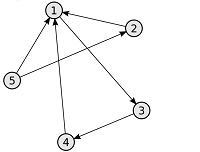

# SimpleNavigator

Implementation of the Simple Navigator project.

## How to use it
1. Gitclone project
2. Change the placement of the graph in the file "interface.cpp"
3. Use Makefile with a target "make"


## Chapter I
## Introduction

In this project I implemented several basic algorithms on graphs. Graphs are one of the basic data structures in programming that are used everywhere. Graphs can be used, for example, to interpret road maps, electrical circuits, geographic maps, for communication between people in social networks, and many other things.  


## Chapter II
## Information

A **Graph** has a finite set of vertices, and a set of edges. Each edge has two points from the set of graph vertices that form the edge points.

**Types of graphs based on the type of edges:**
* *undirected* - a graph in which movement between vertices connected by an edge is possible in any direction


* *directed* - a graph, the edges of which have a direction. Directed edges are also called arcs. Moving from one vertex to another is possible only by arcs of corresponding direction



If besides the edge between two vertices, the weight of the edge is also given, then such a graph is called ***weighted***.


**Types of graphs based on the number of edges:**
* a *null graph* is a graph in which there are no edges


* *incomplete* - the graph has edges, but not from every vertex, there is an edge to every other vertex


* *complete* - the graph has an edge from each vertex to any other vertex


**Types of graphs based on node reachability:**

* *connected* - for any vertex in the graph there is at least one path to any other vertex in the same graph


* *disconnected* - the graph has no path between at least two vertices


For directed graphs there are two more types of connectivity: *strongly connected* and *weakly connected*.
* *strongly connected* - there is a path for any vertex in a directed graph to any other vertex and back. 
* *weakly connected* - there is a path between any two vertices in the graph, but this path can be one-sided.
It means that from vertex A to vertex B the path can exist, but not the opposite way.


**Trees**

An important subtype of graphs are *trees*. \
***A tree*** is a connected acyclic graph in which any two vertices are connected by only one path. The following formula is the same for any tree: *q = n - 1*, where q is the number of edges, n is the number of vertices of the graph (tree). Trees can be built on the basis of both undirected and directed graphs, depending on the problem to be solved.


***A spanning tree*** is a subgraph of a given graph that includes all its vertices and is a tree. The graph edges that are not part of the spanning tree are called chords of the graph relative to the spanning tree.


### Ways of representing a graph

The main ways of representing graphs are:
* *an adjacency matrix* is a square matrix whose dimension is equal to the number of vertices in the graph, and in which $`A_{ij}`$ element of the matrix contains information about an edge from vertex $`i`$ to vertex $`j`$. Possible values that $`A_{ij}`$ can have:
    + for an unweighted undirected graph:
        - 0 - there is no edge between the vertices
        - 1 - there is an edge between the vertices
    + for a weighted undirected graph:
        - 0 - there is no edge between the vertices
        - N - there is an edge between vertices, and its weight is N
    + for an unweighted directed graph:
        - 0 - there is no arc between the vertices
        - 1 - there is an arc (directed edge), which is directed from vertex $`i`$ to vertex $`j`$.
    + for a weighted directed graph:
        - 0 - there is no arc between the vertices
        - N - there is an arc (directed edge), which is directed from vertex $`i`$ to vertex $`j`$, and its weight is N
* *an incidence matrix* is a matrix with the number of rows equal to the number of vertices, and the number of columns equal to the number of edges. It specifies the connections between the incident elements of the graph (edge (arc) and vertex). In an undirected graph if a vertex is incident to an edge then the corresponding element is 1, otherwise the element is 0. In a directed graph if an edge comes from a vertex then the corresponding element is 1, if the edge enters a vertex then the corresponding element is -1, if there is no edge then the element is 0.

You can find an example of representing a graph with an adjacency matrix in the materials.

If the number of graph edges is small compared to the number of vertices, the values of most elements of the adjacency matrix will be 0. In this case it is not reasonable to use this method. For such graphs there are more appropriate ways to represent them:

* *an adjacency list* is one of the ways to represent a graph as a collection of lists of vertices. Each vertex of the graph corresponds to a list consisting of "neighbors" (i.e. vertices that are directly reachable from the current vertex) of this vertex with edge weights.
* *list of edges* is a table (matrix of dimension Nx3), each row of which contains two adjacent vertices, and the weight of the edge that connects them.


## Chapter III

Within this task, all graphs must meet the following requirements:
- Edge weights are only natural numbers
- There may be loops
- Weights may differ on all edges
- Only a nonzero connected graph

## Part 1. Depth- and Breadth-first search 

Implementation of the _s21_graph.h_  library:  
* The library must be developed in C++ language of C++17 standard
* The library code must be located in the src folder in the develop branch  
* When writing code it is necessary to follow the Google style
* Make it as a static library (with the _s21_graph.h_ header file)
* The library must be represented as a `Graph` class that stores information about the graph using an **adjacency matrix**. The dimensionality of the adjacency matrix should be set dynamically when initializing the graph (when loading it from a file)
* The program must be built with Makefile which contains standard set of targets for GNU-programs: _all, clean, test, s21_graph.a_
*Prepare full coverage of the `Graph` class methods with unit-tests
* The class `Graph` must contain at least the following public methods:
    + `loadGraphFromFile(string filename)` - loading a graph from a file in the adjacency matrix format
    + `exportGraphToDot(string filename)`- exporting a graph to a dot file (see materials)

Implementation of the _s21_graph_algorithms.h_ library:  
* The library must be developed in C++ language of C++17 standard
* The library code must be located in the src folder in the develop branch  
* Make it as a static library (with the _s21_graph_algorithms.h_ header file)
* The library must be represented as a ` GraphAlgorithms ` class that stores the implementation of algorithms on graphs. The class `GraphAlgorithms` itself must not know anything about the internal representation of the graph from the class `Graph`. To interact with graph data, the class `GraphAlgorithms` can only use the public methods and properties provided by the `Graph` class. 
* Add to the Makefile _s21_graph_algorithms.a_ target 
*Prepare full coverage of the `GraphAlgorithms` class methods with unit-tests
* The class ` GraphAlgorithms ` must contain at least the following public methods:
    + `depthFirstSearch(Graph &graph, int startVertex)` - a *non-recursive* depth-first search in the graph from a given vertex. The function should return an array that contains the traversed vertices in the order they were traversed. When implementing this function, you must use the *self-written* data structure **stack**, which should be previously made as a separate static library
    + `breadthFirstSearch(Graph &graph, int startVertex)` - breadth-first search in the graph from a given vertex. The function should return an array that contains the traversed vertices in the order they were traversed. When implementing this function, you must use the *self-written* data structure **queue**, which should be previously made as a separate static library
* It is necessary to use *self-written* helper classes `Stack` and `Queue` (you can reuse your solution from the *CPP2* project for this). These classes must contain the following methods:
    + `init()` - creating an empty stack/queue
    + `push(value)` - adding an element to the stack/queue
    + `pop()` - getting an element from the stack/queue followed by its removal from the stack/queue
    + `peek()` - getting an element from the stack/queue without its removal from the stack/queue

*In this and the following tasks, consider that the vertex numbers start from 1*

## Part 2. Finding the shortest paths in a graph

* Add two new methods to the `GraphAlgorithms` class:
    + `getShortestPathBetweenVertices(Graph &graph, int vertex1, int vertex2)` - searching for the shortest path between two vertices in a graph using *Dijkstra's algorithm*. The function accepts as input the numbers of two vertices and returns a numerical result equal to the smallest distance between them
    + `getShortestPathsBetweenAllVertices(Graph &graph)` - searching for the shortest paths between all pairs of vertices in a graph using the *Floyd-Warshall algorithm*. As a result, the function returns the matrix of the shortest paths between all vertices of the graph

## Part 3. Finding the minimum spanning tree

* Add a new method to the `GraphAlgorithms` class:
    + `getLeastSpanningTree(Graph &graph)` - searching for the minimal spanning tree in a graph using *Prim's algorithm*. As a result, the function should return the adjacency matrix for the minimal spanning tree

## Part 4. Travelling salesman problem

* Add a new method to the `GraphAlgorithms` class:
    + `solveTravelingSalesmanProblem(Graph &graph)` - solving the traveling salesman's problem using the *ant colony algorithm*.
You need to find the shortest path that goes through all vertices of the graph at least once, followed by a return to the original vertex. As a result, the function should return the `TsmResult` structure described below:
    ```cpp
    struct TsmResult {
        int* vertices;    // an array with the route you are looking for (with the vertex traverse order). Instead of int* you can use std::vector<int>
        double distance;  // the length of this route
    }
    ``` 

*If it is impossible to solve the problem with a given graph, output an error.*

## Part 5. Console interface

* You need to write the main program, which is a console application for testing the functionality of the implemented s21_graph.h and s21_graph_algorithms.h libraries 
* The console interface must provide the following functionality:
    1. loading the original graph from a file
    2. graph traversal in breadth with output of the result to the console   
    3. graph traversal in depth with output of the result to the console
    4. searching for the shortest path between any two vertices and displaying the result to the console
    5. searching for the shortest paths between all pairs of vertices in the graph with the output of the resulting matrix to the console
    6. searching for the minimal spanning tree in the graph with the output of the resulting adjacency matrix to the console
    7. solving the salesman problem with the output of the resulting route and its length to the console


